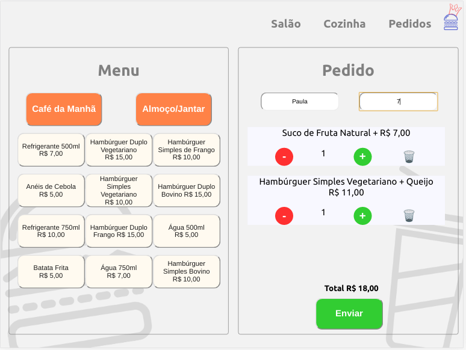
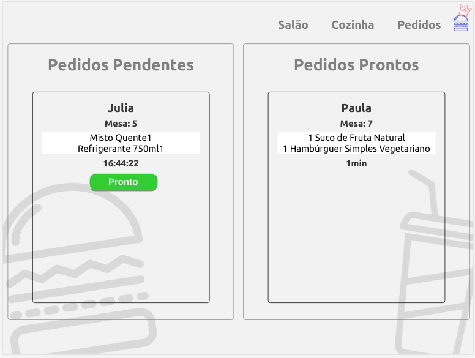
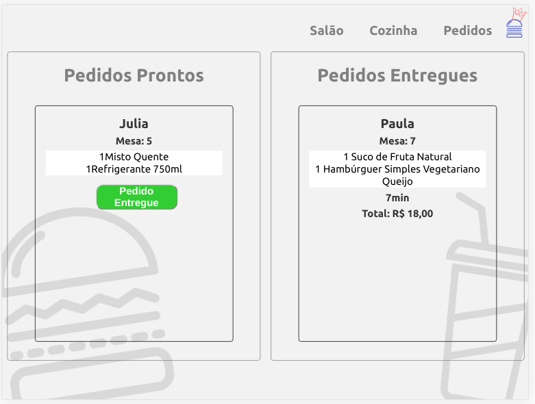

# Burger Queen

## Índice

* [1. Burger Queen](#1-burger-queen)
* [2. Resumo do Projeto](#2-resumo-do-projeto)
* [3. Tecnologias](#3-tecnologias)

***
## 1. Burger Queen

Burger Queen é um fast food 24hrs que utiliza uma interface em tablets para realizar
pedidos e enviá-los para a cozinha, sendo preparados de forma ordenada e eficiente.

## 2. Resumo do Projeto

Para usuários do atendimento ao cliente, será possível escolher entre café da manhã ou almoço/jantar e marcar o nome do cliente e mesa. O pedido aparecerá em tempo real, podendo aumentar ou diminuir a quantidade, assim como excluir algum item antes de enviá-lo para a cozinha.

Para usuários da cozinha será possível ver o horário que o pedido foi realizado pelo cliente e marcar como pronto.

Na aba Pedidos, é possível ver os pedidos prontos e marcar como entregue.
Ao ser entregue, aparecerá o tempo total de atendimento e o valor.  

## 3. Tecnologias

* HTML5
* JavasScript (ES6)
* Aphrodite (CSS)
* React Hooks
* Firebase
* growl-alert
